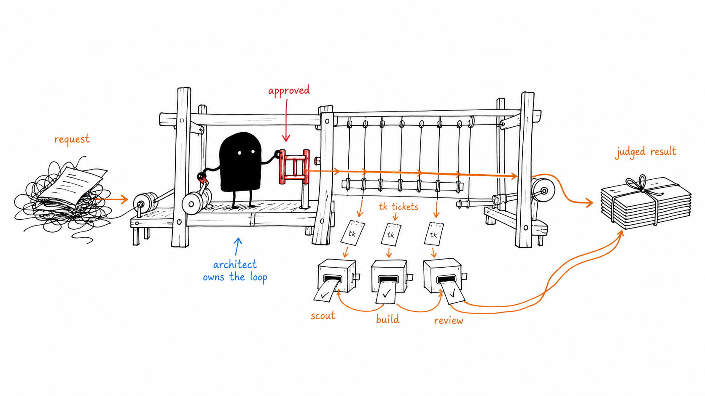

# The last harness you'll ever need.

[](https://github.com/diegopetrucci/the-last-harness/actions/workflows/ci.yml)
[](https://github.com/diegopetrucci/the-last-harness/releases)
[](package.json)

`tlh` (The Last Harness) is an opinionated harness built on top of [Pi](https://github.com/earendil-works/pi).

Two core ideas drive it:
- _"you can outsource your thinking, but not your understanding"_: LLMs can, and should, provide options, help out with discovery and exploration, filling the gaps in your understanding and technical knowledge — they should not, however, be used as a replacement for understanding. [Beware of cognitive debt](https://simonwillison.net/2026/Feb/15/cognitive-debt/).
- _you should not be babysitting your agents_: if you need to manually call tools, run commands, and so on, the harness has failed you.

It achieves this [via a custom orchestration workflow](https://www.stavros.io/posts/how-i-write-software-with-llms/) — you only interface with an architect, whom you engage as a senior peer, and once you're satisfied with the discussion and plan, it takes over until everything is done. Work is pre-reviewed too, often multiple times, so that your time is not wasted in minutiae, freeing you to focus on the bigger picture.

You're also not asked to manually run commands, manage context, or anything like that. This is built-in and done for you. Every further action that you take is because you _want_ to take it, not because you _have_ to. You should not be finding yourself thinking eg "oh, I forgot to trigger `/review`". Your time is worth more.

`tlh` is also slow by default, and relatively token-expensive: it is designed to be used as a long-running, reliable, and predictable tool. You spend time preparing the work, and once it's off, it's off. No babysitting.

If this resonates with you, welcome aboard:

```sh
curl -fsSL https://github.com/diegopetrucci/the-last-harness/releases/latest/download/install.sh | bash -s --
```

## The default TLH workflow: architect first



Most TLH users stay with the **architect** primary agent.

The architect is the default because TLH is optimized for a deliberate loop:

1. clarify the request until the goal and constraints are explicit,
2. inspect the repo and relevant context,
3. propose a plan,
4. wait for the exact word `approved`,
5. create scoped `tk` tickets,
6. delegate implementation and review to focused minor subagents,
7. evaluate those results critically, and
8. report back with judgment and accountability.

That last part matters: the architect does not disappear once work is delegated. It stays responsible for orchestration, pushes back on weak subagent output, decides what to do next, and remains the single point of accountability to the user.

### Minor subagents are focused child sessions

TLH subagents are fresh child sessions, not a giant shared swarm. They get the task and project context they need, not the whole primary conversation. In practice that means less context pollution, clearer responsibilities, and easier review of what each agent was asked to do.

- `repo-scout` for discovery
- `diff-summarizer` for change overviews
- `developer` for implementation
- `code-reviewer` for review
- `librarian` for read-only GitHub repository research (uses `gh` CLI and `git`; TLH caps new execution-bearing librarian, web-scout, repo-scout, and diff-summarizer runs at six minutes (360000ms) unless the caller already set a stricter timeout, but leaves `resume` timeouts unchanged)
- `web-scout` for web research
- `oracle` for a deeper second opinion
- `contrarian` as a bundled default minor subagent for sparing adversarial stress-tests.

Use `contrarian` sparingly, usually before ticket creation, when a proposed change has meaningful uncertainty, tradeoffs, blast radius, a hard-to-undo direction, or debatable assumptions and you want a named specific risk or strongest opposing case steelmanned. It is not the normal diff reviewer — `code-reviewer` reviews changes against tasks — and it is different from `oracle`, which is the broader second-opinion path rather than an opposition brief.

For review independence, `code-reviewer` and `oracle` intentionally prefer an available opposite provider. `contrarian` uses that same opposite-provider pattern for adversarial challenge passes. Anthropic sessions try to use the OpenAI Codex subscription provider for these subagents when it is available, while OpenAI/OpenAI-Codex sessions try Anthropic. When TLH injects one of those opposite-provider subagent models, it also supplies a same/current-provider fallback candidate for retryable model failures; if that fallback is used, the subagent output includes a notice that review independence is reduced. If you only have regular OpenAI API access and not the Codex subscription provider, TLH does not force `code-reviewer`, `oracle`, or `contrarian` onto unavailable Codex-only defaults. All other bundled subagents — including `developer`, `web-scout`, `repo-scout`, and `librarian` — follow the active primary session provider when TLH injects model defaults.

Advanced users can also add trusted user-owned embedded subagents, gated behind the default-off `embedded-subagents` experimental flag. Only architect may initiate embedded delegation, and only the effective same-name profile definition selected from the active TLH profile's `agents/**/*.md` discovery order can authorize it: the selected file must be a regular non-symlink `.md` with `package: embedded`, a valid `name`, and a non-empty `description`; `.chain.md` files and definitions beneath nested `.agents/skills` paths do not participate. A new session or explicit `/reload` recaptures flag state. Product and Bug-hunter can still opaque-resume an architect-started embedded run in the same session under the accepted issue #330 limitation, but attached `resume.chain` execution is re-checked. See [docs/embedded-subagents.md](docs/embedded-subagents.md).

## Why this workflow is useful

### Benefits

- **Better scoping before edits**: the default path favors understanding before action.
- **Cleaner accountability**: one architect owns the loop even when multiple child sessions contribute.
- **Durable decisions**: memory and tickets make important context easier to revisit later.
- **Fresh execution contexts**: focused child sessions reduce drift from long, messy chats.
- **Reviewable work**: implementation is broken into explicit, inspectable steps instead of one giant conversation blob.

### Tradeoffs

- **More process**: TLH is intentionally slower than “just start coding.”
- **More opinionated**: if you dislike tickets, memory, or explicit approval gates, the defaults may feel heavy.
- **Not ideal for every task**: tiny changes may not need the full architect loop.
- **Extra tooling**: TLH expects supporting CLIs and repo-local artifacts that some users would rather avoid.

If you want a harness that stays out of your way, TLH may be too structured. If you want a harness that helps you avoid vague plans, lost context, and agent babysitting, that structure is the point.

## Other primary agents

The architect is the default, but it is not the only mode.

- **Rush** is a selectable primary for small bounded implementation tasks. It edits directly, runs narrow validation, and skips the default architect `tk`/developer/review loop. It can still use `code-reviewer` when that extra pass is worth it, and `oracle` is an optional deeper second opinion rather than a default step. Provider defaults are GPT-5.5 with thinking off on the OpenAI Codex subscription provider, and Anthropic Opus with low thinking on Anthropic.
- **Product** is for product framing, tradeoffs, strategy, and implementation-ready ticket shaping. It does not implement code.
- **Bug-hunter** is for read-only debugging and root-cause analysis before you decide how to fix something.

Use `Shift+Tab` to cycle the current session through `architect` → `rush` → `product` → `bug-hunter` → `disabled`.

### Model and thinking defaults

TLH applies bundled model/thinking defaults per primary agent. For active non-locked primaries, user `/model` choices are respected and persisted per primary under `tlh.primaryAgent.modelOverrides.<primary>`; reset the current primary's override with `/switch-primary-agent model reset`. Locked primaries such as Rush keep their fixed defaults. For review independence, `code-reviewer` and `oracle` prefer the opposite available provider: Anthropic primaries try OpenAI Codex for review, and OpenAI/OpenAI-Codex primaries try Anthropic. TLH adds a dynamic same/current-provider fallback only when it injects that opposite-provider review model; a displayed fallback notice means the run completed with reduced review independence. `contrarian` uses that same independence pattern for sparing adversarial stress-tests rather than as a routine review step. All other bundled subagents — `developer`, `web-scout`, `repo-scout`, `librarian`, and `diff-summarizer` — follow the active primary session provider when TLH injects model defaults.

#### Hidden model defaults in the TLH profile

TLH also ships with a bundled hidden-model filter for selected legacy Anthropic models. Those bundled defaults are built into TLH itself (currently in `extensions/the-last-harness/model-visibility.ts`); they are not written into `settings.json` as default JSON. Any `tlh.modelVisibility` entries you add under the TLH isolated profile at `~/.the-last-harness/agent/settings.json` are user overrides/additional customization only. TLH does not modify your normal `~/.pi/agent/settings.json` for this, and it does not delete auth or model definitions.

For example, you can add an extra hidden pattern of your own and explicitly unhide one model that TLH normally hides by default:

```json
{
  "tlh": {
    "modelVisibility": {
      "hidden": ["anthropic/claude-sonnet-4-*"],
      "visible": ["anthropic/claude-opus-4-6"]
    }
  }
}
```

- `tlh.modelVisibility.disabled: true` turns the filter off entirely.
- `tlh.modelVisibility.hidden` adds your own hidden exact matches or glob patterns. You can use either bare model IDs such as `claude-opus-4-*` or canonical `provider/model` entries such as `anthropic/claude-opus-4-*`.
- `tlh.modelVisibility.visible` lets specific models stay visible even if they match a bundled default or one of your hidden patterns.
- `tlh.modelVisibility.unhide` is accepted as an alias for `visible`.

Hidden models are removed from browsing/listing surfaces such as the `/model` picker and `tlh --list-models`, but the underlying auth/model definitions remain intact and exact direct selection by canonical `provider/model` still works. For example, a hidden model can still be selected directly with `/model anthropic/claude-opus-4-6`.

To undo the behavior, either set `tlh.modelVisibility.disabled` to `true`, remove your own `hidden` overrides from `~/.the-last-harness/agent/settings.json`, or add the models you want back under `tlh.modelVisibility.visible`/`unhide`.

When primary agents are disabled, TLH stops applying those primary-agent workflow/persona rules, but the underlying subagent machinery still exists.

## TLH is intentionally opinionated

TLH is not just “Pi, but with a new prompt.” The harness bakes in workflow and UX opinions:

- **Project memory is mandatory**: TLH requires Gnosis (`gn`) so decisions, constraints, rejected alternatives, and lessons can live in repo-local memory instead of disappearing into chat history.
- **Ticketed execution is mandatory for architect/product flows**: TLH requires `tk` for dependency-tracked tickets and installs the managed command at `~/.the-last-harness/agent/bin/tk` when it needs to supply one. Rush is the main exception for very small direct-edit tasks.
- **Context is capped on purpose**: TLH uses a 200k context cap, expects compaction instead of endless chat growth, and provides `/context` so you can inspect where your tokens are going.
- **Fresh child contexts are the default**: child sessions start clean and focused rather than inheriting an entire messy parent transcript.
- **Model defaults are role-aware**: TLH ships bundled per-role model/thinking defaults instead of expecting every user to tune everything manually.
- **Safety and quiet-by-default UX matter**: isolated-profile guards, quieter tool rendering, trimmed footer noise, usage-window visibility, notifications when turns finish, and dirty-repo prompts are part of the package.
- **Useful integrations are already wired in**: web research and MCP support are part of the default story rather than an afterthought.

## What you get beyond the workflow

TLH also aims to make the day-to-day session experience calmer and safer:

- isolated profile installation so your normal Pi setup stays separate,
- quieter UI defaults so tools and bash output do not constantly fight for attention,
- a lightweight first-party `/annotate-last-message` command that opens a native annotation window for the latest assistant reply and turns submitted notes into agent feedback,
- a first-party `/annotate-git-diff` command that opens a native review window and pastes submitted feedback back into the editor as a prompt,
- a first-party `/tokens` command that generates a local HTML token-spend report for the current session from sanitized session analysis,
- a first-party `/what-consumed-my-session-limit-and-tokens` command that generates a local HTML report showing which TLH sessions across all your projects consumed tokens within the current session-limit window, with per-session and per-provider breakdowns,
- bundled web-search support for research-heavy work,
- bundled MCP adapter support,
- subscription usage footer controls,
- completion notifications, and
- conservative settings merges that preserve user-owned isolated configuration.

## Add your own skills, extensions, etc

You can add your own skills, prompts, extensions, and packages to TLH.

User-level:
- `~/.the-last-harness/agent/skills/`
- `~/.the-last-harness/agent/prompts/`
- `~/.the-last-harness/agent/extensions/` (or via `tlh install github-user/repo`)

Repo settings:
- `.pi/skills/`
- `.pi/prompts/`
- `.pi/extensions/`


After adding files, installing a package, or saving project trust, run `/reload` in TLH (or restart it) so the new resources are picked up.

Normal `tlh update` runs are conservative: they preserve user-owned isolated-profile resources instead of overwriting them, and they still do not touch your normal Pi config.

`tlh doctor` inspects the active isolated TLH profile and is read-only by default: it reports drift and missing prerequisites without rewriting settings, creating backups, or touching normal `~/.pi/agent`. `tlh doctor --repair` is narrower than `tlh update`: it only repairs TLH-owned isolated-profile drift such as packaged settings defaults, bundled subagent prompt copies, and managed `gn`/`tk` helpers. Runtime replacement, `gh` auth, EXA keys, and MCP config stay manual. When settings repair does write, it uses the normal `settings.json.backup-*` backup flow; to undo, restore the backup you want or rerun `tlh update`.

Backup files at the isolated-profile root (`settings.json.backup-*`, `keybindings.json.backup-*`) are pruned automatically on install and update: any backup older than ~28 days is removed, but the two newest backups are always kept regardless of age. This pruning is scoped strictly to the isolated profile (`~/.the-last-harness/agent`) and never touches `~/.pi`. If you want to keep a particular backup indefinitely, copy it to a location outside the isolated profile before it ages out.

## Everything else, aka the docs dump

- Slash commands reference: [`docs/commands.md`](docs/commands.md)
- Install, update, uninstall, paths, and undo steps: [`docs/install.md`](docs/install.md)
- Common failure recovery and conservative troubleshooting: [`docs/troubleshooting.md`](docs/troubleshooting.md)
- Gnosis, `tk`, and TLH workflow integrations: [`docs/integrations.md`](docs/integrations.md)
- Web search setup, privacy, and opt-out: [`docs/web-search.md`](docs/web-search.md)
- MCP usage and caveats: [`docs/mcp.md`](docs/mcp.md)
- Launch telemetry and opt-out: [`docs/telemetry.md`](docs/telemetry.md)
- Git commit attribution footer, setting, and toggle flow: [`docs/git-attribution.md`](docs/git-attribution.md)
- Local testing and development: [`docs/local-development.md`](docs/local-development.md)
- Release notes: [`CHANGELOG.md`](CHANGELOG.md)
- Maintainer release process: [`docs/releasing.md`](docs/releasing.md)

## Prerequisites

Node.js >=22.19.0 must be available on your `PATH`.

TLH runs its own pinned Pi 0.82.1 from a private runtime at `~/.the-last-harness/runtime` — a global or pre-installed `pi` on your PATH is never used or modified; tlh and any existing `pi` are fully decoupled.

The installer writes an ownership marker (`.tlh-runtime-owned`) into the runtime prefix on every successful install or repair. Ownership is determined by this marker, not by directory shape alone — `npm install --prefix` produces an identical `bin/lib` layout regardless of who ran it, so shape alone is not a reliable signal. Accordingly, the installer refuses a non-empty unmarked runtime prefix that has no recorded TLH provenance; this matters most when using a non-default `--agent-dir` whose sibling `runtime/` directory could belong to a separate installation. Older TLH installs from before the marker was introduced gain it automatically on the next `tlh update` or installer rerun — no action required.

TLH runs its own private runtime and never removes or modifies anything under `~/.local`. Any `pi` you installed yourself (or that a separate tool installed) is left entirely alone. The uninstaller removes the private runtime only when a valid ownership marker is present; a pre-marker or unmarked runtime is skipped and the uninstaller prints a `rm -rf <dir>` command you can run manually if you want to clean it up. To remove the private runtime manually: `rm -rf ~/.the-last-harness/runtime`. If you previously installed pi into `~/.local` and want to remove it yourself: `npm uninstall -g --ignore-scripts --prefix ~/.local @earendil-works/pi-coding-agent` (optional, user-initiated only).

**`gh` CLI (for `librarian` GitHub research):** The `librarian` subagent performs read-only GitHub research using the `gh` CLI and `git`. Install `gh` from <https://cli.github.com/> and authenticate with `gh auth login` before using librarian. Run `gh auth status` to confirm. Without an authenticated `gh`, librarian reports what it could not verify rather than silently failing.
